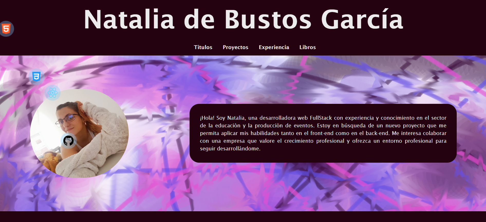

# Portafolio Natalia 
 

Portfolio Natalia de Bustos García.

Este es mi portafolio personal, en el se pueden encontrar una pagina web dividida en diferentes secciones. Cada pagina nos habla de diferentes cosas, se puede observar los proyectos que tengo en github, mi experiencia y mis titulaciones. También se pueden encontrar en el footer enlaces a github, linkeldIn y a un formulario.

## Tabla de Contenidos

- [Instalación](##instalación)
- [Uso](##uso)
- [Contribución](##contribución)
- [Licencia](##licencia)

## Estado del Proyecto
Fase 1💻  
🚧El proyecto se encuentra en estado de construcción 🚧.

## Instalación 💻

El proyecto contiene react y vite. 
La funcionalidad que tiene es muy sencilla por lo que solo descargandolo y teniendo encuenta lo que se usa os tendría que funcionar.
- Se debe instalar node en el ordenador e instalar: npm install
- Al inicializar la pagina debemos escribir npm run dev

## Uso

Teniendo en cuenta la anterior información se podría navegar por todas las páginas de manera libre. 

## Desarrolladora:

><a href="https://www.linkedin.com/in/natalia-de-bustos-garc%C3%ADa-5ba965298/">- Natalia de Bustos García</a> 

## Tecnologías utilizadas

 
 
 

## Metodologias Agiles
- <a href="https://www.figma.com/file/hXMPqeTh2pwQkFuyW0OUR1/HappyPhone_v2.0-(Copy)?type=design&node-id=11%3A3&mode=design&t=4z7u88A7d95cwQfn-1"> Figma </a>  
- <a href="https://github.com/natalia9519/portfolio-natalia">GitHub</a>  
- <a href="https://portfolio-natalia-sage.vercel.app/"> Deploy </a>

## Licencia

Este proyecto está bajo la Licencia [CCO](LICENSE).

Las fuentes utilizadas en este proyecto estan sujetas a licencia SIL con Copyright &copy; 2014, Indian Type Foundry (info@indiantypefoundry.com)
